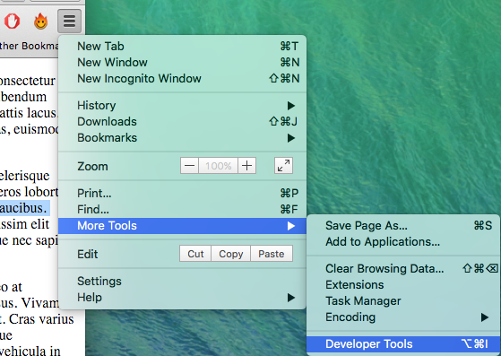
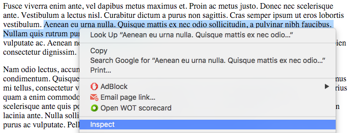

# Learning CSS3

Before you start you need to pull any _upstream changes_. Detailed instructions can be found in the **Setup** lab.

## 1 Introduction to CSS3

The purpose of HTML is to define the structure and contents of a website. It is not intended to contain any representational markups. CSS (Cascaded Style Sheets) is designed for that purpose.

> CSS is amazingly powerful. As an example, click to visit [CSS Zen Garden](http://www.csszengarden.com). Different CSS files are applied to a single HTML file by clicking on the navigation links to the right of the screen. There's a book for it as well on [Amazon](http://www.amazon.co.uk/ZEN-CSS-Design-Visual-Enlightenment/dp/0321303474).

This worksheet is split into two sections:

1. The basics of CSS
2. The CSS box model and layouts

In the first part of this lab, you do the following tasks, and it takes approximately 2 hours.

1. Perform basic formatting (colors, fonts, etc.) of your web pages.
2. Use CSS classes and identifiers to pick the correct elements 
3. Fine-tune your selection by picking nested elements and using pseudo elements.

> We use CSS as a synonym for CSS3, which is the newest version of the styling language.

### 1.1 CSS Basics

Start by locating the `exercises/04_css/01_formatting/` directory. This contains a number of files arranged in a set of directories (see below).

> This diagram was created using the `tree` command run inside the `01_formatting/` directory.

1. The `index.js` script is in the root directory and contains the routes served by the Express web server (just like the ones in the previous weeks).
2. The `package.json` includes all the _metadata_ for this project including the packages that need to be installed. To install all the required packages run `npm install`.
3. The HTML files that are served by the routes are stored in a directory called `html/`.
4. Any resources that are linked to the html document need to have their own external URLs and are kept in the `public/` directory.
    1. There are some CSS files which we will be editing.
    2. There are some images loaded by the web pages.

```
.
├── index.js
├── package.json
├── html
│   ├── comparison.html
│   ├── csstest.html
│   ├── hello-world.html
│   ├── selectors.html
│   └── targets.html
└── public
    ├── css
    │   ├── selectors.css
    │   ├── simple.css
    │   └── targetstyles.css
    └── images
        ├── comparison.png
        ├── computer.png
        └── tickmark.png
```

The purpose of a style sheet is to collect all information on how the pages in a website should be visually rendered, into one place.

Ideally, all web pages in a site should be linked to one style sheet (one CSS file) that contains all visual formatting rules for the entire website.

This approach makes a clear separation between content and representation. The approach makes it easy to get a uniform outlook for the entire site. Moreover, one can easily build alternative views that may be strikingly different visually yet they share the same content.

1. Look at the `index.js` file and locate the base route (`/`). Notice that it loads the contents of the `html/hello.html` file and sends this to the browser.
2. In the `<head>` tags you should see a `<link href="css/hello.css" type="text/css" rel="stylesheet" />` tag which loads the `public/css/hello.css` stylesheet file. Note that the script defines all the files in the `public/` directory as publicly visible which means the contents of this folder are treated as being in the web server root directory. In simple terms we don't need to specify the `public/` directory in the path to the CSS file.
3. Now start the server (if you have not already done so) and view the base url. You will see the heading is coloured in red.
    1. Look at the `hello.css` file and see if you can figure out why this has happened.
    2. Change the colour of the heading to a different [named colour](https://developer.mozilla.org/en-US/docs/Web/CSS/color_value).
4. Add the following to the css file and see what effect this has on the appearance of the web page.
    1. The style applied to the `<body>` tag also applies to all tags nested within it.

```css
body {
    font-family: Arial, Verdana, sans-serif;
}

h1, h2 {
    color: blue;
    font-weight: bold;
}
```

Examine the CSS file and verify that you understand its contents. Pay attention to the following points:

- The file contains two rules. Each rule begins with the list of elements it has an effect on. The first rule is applied to the `body` element whilst the second rule is applied to `h1` and `h2` header elements.
- Followed by the element names (called selectors), there is a block starting with `{` and ending with `}`. This block contains a list of properties.
- The first rule (applicable to the `body` element) contains one property for setting the font.
- The second rule (applicable to major headers) contains two properties, one for setting blue font color and the other for bold text.
- The rules are automatically in effect in the nested subelements, so the font setting for `body` element applies to all elements in the page, including headers, lists, and paragraphs. 
- The fonts are given as a list of alternatives. The browser uses the first font in the list that it is capable of. The list should always end in a generic font such as `serif` or `sans-serif`.

### 1.1.1 Test Your Knowlege

1. View the `/test` url which should display a page about 1980s computers.
2. Create a new stylesheet in the `public/css/` directory called `test.css`.
3. Add a `h1` selector and apply a style to turn the headings _orange_.
4. Edit the `csstest.html` file and link to the spreadsheet.
    1. If you have done this correctly the heading should be orange when you refresh the browser!
5. Spend time experimenting with different **selectors** and add new **rules** and **properties** to the file and see how they affect the web page. There is a complete list of CSS property names and possible values (among other information) at the [W3C Cascading Stylesheets documentation](http://www.w3.org/TR/CSS/) website.
    1. Add a border to each list and change the color of list items to dark grey. 
    2. Indent the paragraphs and lists.
    3. Make figure captions smaller and use bold face.
    4. Set a background color for the page.
6. Try specifying the page colours:
    1. Using named colours ("red", "blue", etc.).
    2. Specifying the same colours using RGB decimal values, eg `rgb(65,105,225)`.
    3. Specifying the same colours using RGB Hex values, eg `#4169E1`.
    4. Set the text _opacity_ to 70% (0.7) by adding an alpha channel to the page colours, eg `rgba(65,105,225,0.7)`
7. Try setting the font size using the following measurement options, how do they relate to each other?:
    1. Start by specifying the absolute size of the text by using _pixels_ (px)
    2. Now change this to use _points_ (pt)
    3. What is the change when you define the font sizes in _ems_.
    4. Finally change all font sizes are in percentages.

| Unit | Type     | Meaning                                                  |
|------|----------|----------------------------------------------------------|
| em   | relative | multiplier of the default font size (letter 'm' width).  |
| %    | relative | percentage of default font size.                         |
| px   | absolute | number of on-screen pixels.                              |
| pt   | absolute | Amount in points. A point equals to 1/72 of an inch.     |

Just like HTML5 files, CSS files should be validated using the [W3C CSS Validation Service](https://jigsaw.w3.org/css-validator/).

Validation makes sure that your CSS file complies with the CSS syntax. It may also help you to spot errors in the CSS file.

Go to the validation page, and validate the file you created. If no errors are found, introduce some on purpose and see how the validator reports them.

### 1.2 Selectors

So far, the rules in the CSS file have been applied to all elements matching one of the selectors. For example, all paragraphs have automatically had the same looks.

It is possible to create a separate outlook for some instances of a given element by using classes or selectors.

- Classes can be applied to multiple instances of an element. These instances can also be a mixture of various element types, such a paragraphs (`p`) and first-level headers (`h1`).
- Identifiers are unique to each instance.

#### 1.2.1 Classes

An instance of an element is assigned to a class by entering a class attribute in the corresponding start tag in the HTML file.

Enter the following line of markup into `csstest.html`:

```html
<p class="copyright-notice">Photo courtesy of Pekka Virtanen.</p>
```

In the CSS file, assign a rule for paragraphs belonging to `copyright-notice` class:

```css
p.copyright-notice {
    font-size: 0.8em;
}
```

The rule is now applied to only those paragraphs that belong to `copyright-notice` class. There can be many such paragraphs, each having a similar `class` attribute. Verify this in the browser.

Alternatively, you could create a rule for all elements in `copyright-notice` class, regardless of whether they are paragraphs, list items, or something else:

```css
.copyright_notice {
    font-size: 0.8em;
}
```

An HTML element can belong to multiple classes simultanously:

```html
<p class="info urgent">The tour starts at 10 am.</p>
```

The paragraph element above belongs to two classes: `info` and `urgent`.

#### 1.2.2 Identifiers

As seen before, multiple elements can belong to the same class. However, unique identifiers are a better option to generate rules that are applied only once.

This is marked in HTML by the identifier attribute:

```html
<p id="special">This is different from all other paragraphs</p>
```

The CSS rule looks as follows:

```css
#special {
    font-size: 0.8em;
    color: yellowgreen;
    font-style: italic;
    border-left: 2px solid black;
    margin-left: 40px;
    padding-left: 10px;
}
```

Add the paragraph and the corresponding rule in your files and verify the outcome.

Alternatively, you could use `p#special`, but - since there cannot be another special element that is not a paragraph - this would result in the same outcome.

Now, open file `selectors.html` and the associated style sheet `selectors.css` to play with classes and identifiers.

In the file, there are five paragraphs (`p`) and one header (`h1`). Verify that you understand the following:

- The first and the second paragraphs are regular paragraph elements (start tag `<p>`). For these paragraphs, standard rules for `p` elements are applied.
- The third and the fifth paragraphs are assigned a common class name (start tag `<p class="alert">`). For these paragraphs, standard rules for paragraphs are applied. In addition, rules for all `alert` class elements (`.alert`) are applied as well as those rules that are specific to paragraphs belonging to alert class (`p.alert`).
- The fourth paragraph is supposed to have a unique formatting. Thus, it is assigned an identifier (start tag `<p id="unique">`). For this paragraph, standard paragraph rules plus rules specific to this identifier (#unique) apply.
- The header belongs to `alert` class like two of the paragraphs. It is affected by a rule that is targeted to all elements of `alert` class (`.alert`). In addition, all rules for `h1` would be applied but there is none.
- The rule for `body` element is applied to all elements as they are nested elements inside the body element.

If a property of an element would be defined in multiple CSS rules, the rule whose selector has the highest specificity wins. For instance, the properties defined in a class-specific rule override the attributes defined in the general rule for the element.

#### 1.2.3 Test Your Understanding

1. Modify the `selectors.html` and `selectors.css` files so that the first, third, and fifth paragraph appear underlined (in addition to the existing formatting). You should achieve this with a single CSS rule.
2. In `csstest.html` file, add a paragraph about Basic programming to the bottom of the page (Basic was a common language for programming 80's home computers). Below the paragraph, add a sample program as below:
    ```
    10 PRINT "Hello, World"
    20 INPUT "Continue (y/n)?", R$
    30 IF R$="y" THEN GOTO 10
    ```
    Find the proper markup for doing this. Include the necessary CSS rule(s) to get a pleasant outcome. Validate your work.

3. Open the file `comparison.html` containing the comparison table of three computers. Create a new CSS file and link it to the HTML file. Generate the contents of the CSS file to make the HTML table resemble the image `comparison.png` in the lab's `public/images/` directory as accurately as possible. Validate.

Some examples of CSS table rules can be found [here](http://www.w3schools.com/css/css_table.asp).

### 1.3 Fine-Tuning Your CSS

In this part, we look at various ways to modify the CSS rules. The selections can be applied to elements in a specific context such as inside a specific element. Furthermore, pseudoelements allow selection of only the first row or character inside the content, for example.

Finally, we look at the options for placing CSS.

#### 1.3.1 Selecting Elements

So far, we have used elements, classes and identifiers to pick the applicable rules.

It is possible to define the targets of rules in a more specified way. Open file `targets.html` to demonstrate this. In the file, there's a complex list structure.

The file is linked to `targetstyles.css`, which contains only the font settings for the entire document.

Write the following rules to `targetstyles.css`:

```css
ol > li {
    color: green;
}

ul li ul {
    font-weight: bold;
}

ul li ul li ul {
    color: blue;
}
```

As the HTML file contains several list elements, nested and unnested, we can't make the correct elements as targets of the rules using a single element as a selector. However, CSS provides a straightforward way to achieve our goal.

- In the first rule, selector `ol > li` matches only those `li` elements that are direct children of the unordered list.
- In the second rule, those unordered lists are selected that appear in list items of a higher-level unordered list. Note that this rule applies to both the second and the third levels of the nested list in the example.
- The third rule applies only to the third level (and potential deeper levels) in nested unordered lists.

#### 1.3.2 Changing the Appearance of Forms

A useful selector for styling forms is CSS attribute selector which applies to an element with a particular attribute set to a value. For example

```css
input[type="text"] {
    color : blue;
}
input[type="submit"] {
    font-weight : bold;
}
```

Of course, you can use also the normal selectors for elements like `form`, `legend`, `fieldset`, etc. Unfortunately support for styling form controls is inconsistent across browsers. 

Therefore, you should always check that the results are what is expected.

#### 1.3.3 Nested and Pseudo Elements

Pseudoelements allow formatting only certain parts of an element. Using pseudoelements, it is, for instance, possible to pick the first letter or line of a paragraph.

Add the following line into `simple.css` (that is linked to `csstest.html`):

```css
p::first-letter {
    font-size:8em;
}

p::first-line {
    font-weight: bold;
}
```

Reload the page in the browser and see the changes.

In pseudoelement notation, a double colon (`::`) appears after the element name. This precedes one of the following: `after`, `before`, `first-letter`, `first-line`, or `selection`.

The first two (`after` and `before`) are normally used with `content` property to insert new representational content.

#### 1.3.4 Location of CSS

In all the examples above, the CSS rules have been located in a single CSS file. It is the best place for CSS rules from modularity's point of view. 

Technically, there are other options for placing CSS rules, even though they are considered bad practice.

The first alternative is to make CSS inline:

```html
<p style="color: green">Hello!</p>
```

The second alternative is to generate a page-specific internal stylesheet inside the `head` element of an HTML document:

```html
<head>
  <style>
    p {color: green};
  </style>
</head>
```

As these approaches obscure the separation of content and presentation, their use is discouraged. It may, however, be useful to recognize them, as they are sometimes used.

#### 1.3.5 Test your Understanding

You need the aforementioned file `simple.css`. CSS pseudo elements `::before` and `::after` allow inserting content right before or after an element for stylistic purposes. These are normally used in conjunction with `content` property that specifies the content to be included.

- Add a rule that adds the text `Note!` before each paragraph in `csstest.html`.
- Add a rule that prints the image of a tick mark after each paragraph in `csstest.html`. A public domain tick mark image (Author: Kosta Kostov, via http://www.publicdomainpictures.net/) can be found in the lab's `public/images/` directory.

----

## 2 Using CSS for Page Layout

Having mastered the essentials of using CSS to change the page formatting you will you learn to use CSS to create a responsive layout for a web page or a website.

You first learn the basics of positioning elements to create a unified layout. The positioning is done using CSS, based on the proper markup of elements using HTML. In addition to the positioning of the elements, you learn to design the navigation and create a multi-level menu for your website.

In this section you will be doing the following tasks, it takes approximately 2 hours.

- Use CSS box model to define the appearance of your web pages.
- Position elements on a web page.
- Implement navigation functionality with CSS.

### 2.1 CSS Box Model

First locate the `exercises/04_css/02_layout/` directory, start the Express server and open the `/boxmodel` route. This will display the contents of the `boxmodel.html` file. This will be used to illustrate the CSS box model which is vital for understanding how to set the dimensions, margins and paddings of elements in a web page. Check the contents of the file. You notice that it contains four paragraph elements, each labeled to belong to a different class.

Create a file called `boxstyles.css` in the correct directory and link it to the HTML file.

In the newly-created CSS file, add the following lines of code:

```css
p.one {
    border: 1px solid black;
    padding: 3em;
    margin:  1em;
    margin-bottom: 0em;
}
```

This sets the visual appearance of the first text paragraph that belongs to class `one`. Reload the page and see how the paragraph is affected.

To truly understand the lines of code above, it is important to get an idea of the CSS box model.

The box model is applicable to block elements, i.e. elements that  hold a rectangular space in the screen. Recall that common HTML elements such as headers, paragraphs, and lists are block elements.

For each element, you can set various CSS properties, such as:

- `border`: the thickness and looks of the border outlining the element
- `margin`: the amount of free space outside the border
- `padding`: the amount of free space inside the border


Notice that borders are normally invisible for most elements (such as regular paragraphs). In spite of this, you can use margin and padding settings in the normal way.

By default, the settings above apply to all four directions. In the example above, the margin setting was overridden for the bottom direction.

Now, add rules for the remaining paragraph classes (two, three, four) to generate the following appearance for the remaining paragraphs:

- class `two`: same border as for class `one`, no padding, 5em margins except for the top where no should be no margin.
- class `three`: a 3-pixel wide solid black border only in the left edge of the paragraph, 1em padding except for the top where no padding is applied, 2em top margin, 8em bottom margin, no left and right margins.
- class `four`: a 5 pixels wide dashed red margin with rounded corners (1em radius).

Verify that all four paragraphs are displayed exactly as intended.

#### 2.1.1 Developer tools

In Google Chrome browser, there are a built-in Developer Tools for viewing the layout of an individual element. It is an important tool for finding and correcting layout problems. Click options menu to the right of the menu bar, then More Tools ==> Developer Tools to view it.



Alternatively, you can simply right-click on an element and select **Inspect**. Try it for each differently-formatted paragraph on your page.



#### 2.1.2 Test Your Understanding

The file `box_assignment.png` in the lab's `public/images/` directory contains an image of intended appearance for a webpage. Using CSS box model, construct an HTML page and the associated CSS file that reproduce the appearance of the image.

In the lab's `public/images/` directory you also find the public domain image `berries.png` (author Scott Bauer, via http://commons.wikimedia.org) needed for this task.

----

### 2.2 Positioning Elements

So far, we have modified the way how individual elements look and how much space should be left inside or outside the margin.

Next, you learn how to modify the position, width and height of a block element. As a result, you will be able to generate exactly the desired layout for your web page.

There are three positioning schemes in CSS:

1. Normal flow of positioning
2. Floating positioning
3. Absolute positioning

So far, we have used normal positioning where elements are stacked on top of each other in the order they appear in the HTML file.

Next, let's take a look at the alternative positioning schemes.

#### 2.2.1 Float Positioning

A floating element is an element whose location in the web page is treated in a special way, so it is removed from the normal flow of positioning. The remaining elements on the page are rendered so that they wrap around the floating element.

Floating positioning is common for figures. A floating image can be positioned in the desired location on the page, and any surrounding text paragraphs and other elements can be set to surround the image nicely.

Access the `/floating` url and open the `floating.html` and `floatstyles.css`.

The HTML file contains one image tag. First, add an identifier for the figure holding the image, as it is going to be treated in a different way compared to potential other figures in the document:

```html
<figure id="floating">

    <figcaption>Onions are delicious.</figcaption>
</figure>
```

Next, open the linked CSS file `floatstyles.css` and add the following rule:

```css
figure#floating {
    float: right;
}
```

Reopen the page in the browser. The figure is now positioned to the right, together with the caption. The text wraps around the figure.

Next, we make a floating fact box that contains multiple elements. Add the following files in the HTML file `floating.html` right after the main heading, before any paragraphs:

```html
<section id="factbox">
<p>Did you know?</p>
<ul>
    <li>The latin name for onion plant is <em>Allium Cepa</em>.</li>
    <li>Onions have been used in cooking for thousands of years.</li>
    <li>89% of onion's content is water.</li>
</ul>
</section>
```

This time, the floating entity consists of two elements: a paragraph (`p`) and an unordered list (`ul`). Thus, we need a special container element that contains both the paragraph and the list. 

There are two alternatives for the container: either a generic `div` element or a more semantic `section` element. As the header and the list in the fact box clearly form a semantic entity, it is advisable to use the latter.

Now, add the rule for the `section` element whose identifier is `factbox`:

```css
section#factbox {
    float: left;
    border: 1px solid black;
    margin: 2em;
    padding: 1em;
}
```

Reload the page to see the effect of the modification. The fact box should appear bordered on the left side of the content, text wrapping around it.

Test, how the floating elements behave as you resize the window.

#### 2.2.2 Absolute Positioning

The third positioning scheme is absolute positioning. In this scheme, an element's absolute position is given, usually in pixels or percentage.

Next, let's create navigation links for the onion page. Initially, we set the links to be located in accordance with the default flow of the elements. Then, we use CSS to reposition the links into the top left edge of the screen.

Add the navigation information (using the HTML5 `nav` element) into the bottom of `floating.html` file, inside the body element:

```html
<nav>
  <a href="/nutrition">Nutrition</a> 
  <a href="/recipes">Recipes</a> 
  <a href="/growing">Growing</a> 
  <a href="history">History</a>
</nav> 
```

Note that the routes that the links point to do not exist. We could add them later.

Reload the page and see how the links are positioned by default.

To move the navigation items to the left edge, we use absolute positioning. Add the following rule for the nav element to the CSS file:

```css
nav {
    position: absolute;
    top: 120px;
    left: 40px;
    width: 100px;
}
```

This sets the absolute position of the element to be exactly 120 pixels from the top of the page and exactly 40 pixels from the left edge of the page. Furthermore, the width of the element is set to 100 pixels.

Note that the elements positioned using absolute positioning may appear on top of other elements, essentially garbling the output. To avoid this, we move the left edge of the page contents to 200 px, to facilitate the 100 px wide navigation element, starting at 40 px. Modify the rule for `body` element to contain the new `margin-left` property:

```css
body {
    font-family: Arial, Verdana, sans-serif;
    margin-left: 200px;
}
```

#### 2.2.3 Test Your Understanding

1. Open file **columns.html**. Generate a style sheet **columnstyles.css** where the paragraphs are displayed in:
    1. two columns
    2. three columns
    3. Search for CSS properties containing the word `column`. Currently, there are browser restrictions and inconsistencies in displaying multi-column content, but the workarounds are well documented. Try to take these into account in your CSS.
2. In the HTML chapter, you created several websites. Build a CSS file for one of these pages which should incorporate a floating image.

### 2.3 Navigation

The next task is to build a navigation menu bar to the website using CSS. Depending on the number of menu items, the menu bar can contain multi-level menus.

A menu bar is be defined as an HTML unordered list. Each menu in a menu bar is a list item.

The menus can contain submenus. A submenu is coded as a list that is within the parent menu's list item.

Open the `/menu` route and find the appropriate html and css files.

Try the functionality of the two-level menu by hovering the mouse pointer over the **Item 1**, **Item 2**, and **Item 3** texts. The last two have submenus.

Examine, how the hierarchical menu was created using plain CSS. Note that the links are just dummies; they don't lead to any web pages. In the example, the barebones menu bar contains only minimum formatting that is necessary for correct layout.

Important things to note:

- List bullets are removed by setting `list-style: none`.
- Second-level list items are set, by default, hidden: `visibility:hidden`. 
- Whenever the mouse pointer hovers over the first-level list item, the second level list-item is set visible. The selector `nav ul li:hover > li` points to those `li` items that are descendants of `nav`, `ul`, and (one that a mouse hovers over) `li` elements.

#### 2.3.1 Test your Understanding

1. Add a fourth menu with a few menu items to `menu.html`.
2. Use CSS to format the menu bar in the way that is shown in the `public/images/menu.png` file.
3. Modify one of the second-level menu items by adding a third-level menu, you will need to modify the css file.
