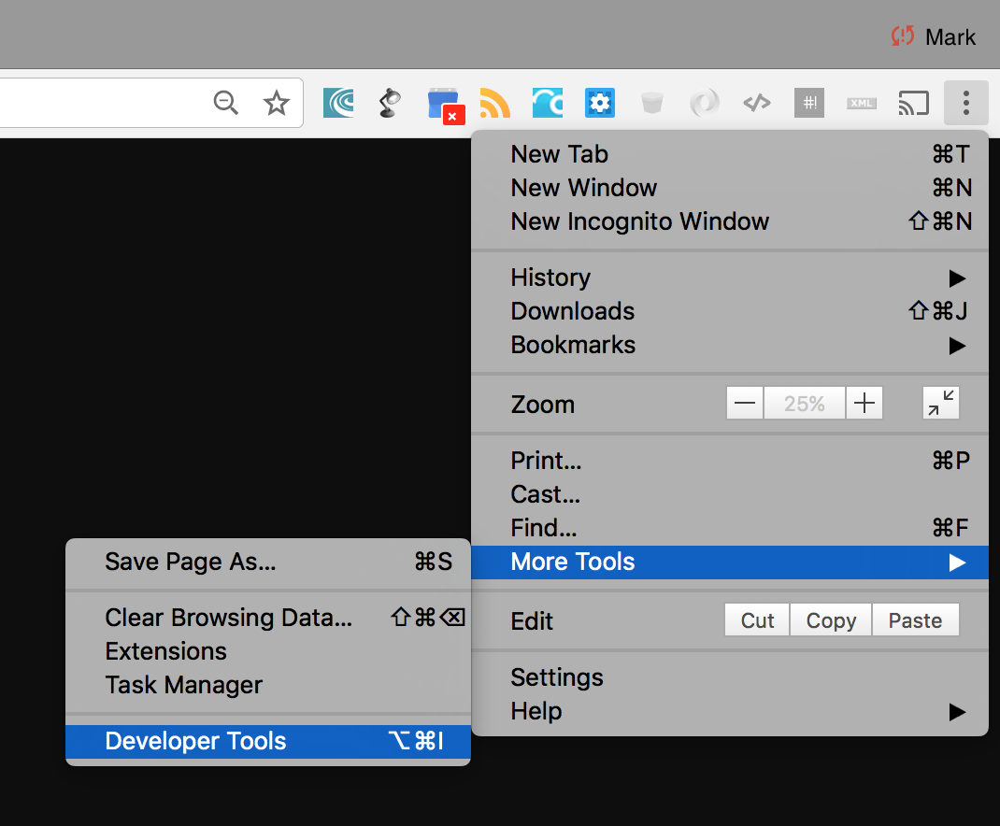
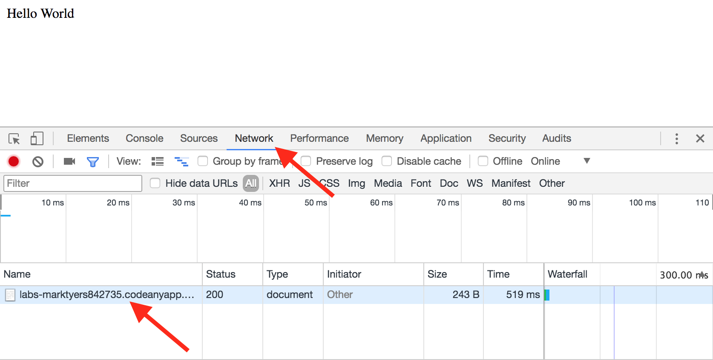
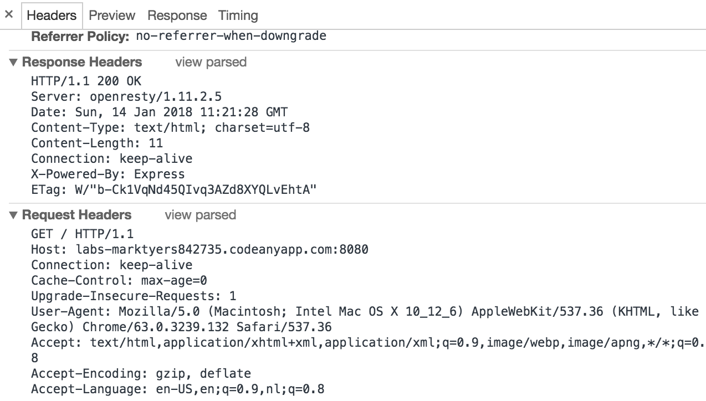
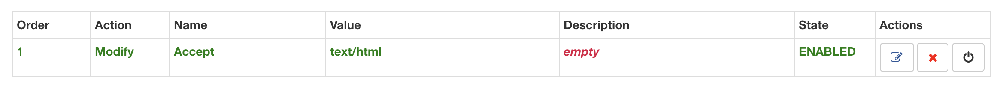

# The HTTP Protocol

In the lecture you learned about the HTTP protocol which is used to transfer information between web server and the web browser. 

The HTTP protocol is used by web servers to send content to devices such as web browsers. Without this the World-Wide Web (WWW) would not exist. In this lab you will be using the [NodeJS](http://nodejs.org) language running the [Koa web server](https://www.npmjs.com/package/koa) to write scripts that make use of this protocol.

HTTP uses a [request-response](https://en.wikipedia.org/wiki/Request–response) mechanism which involves a _client_ device sending a request to the server. This request includes:

1. The _resource_ it is requesting (defined as a [URL](https://en.wikipedia.org/wiki/URL)).
2. Additional information such as filters (provided as one or more [query strings](https://en.wikipedia.org/wiki/Query_string)).
3. The action or [method](https://developer.mozilla.org/en-US/docs/Web/HTTP/Methods) it wants to carry out (typically GET or POST).
4. Additional information such as log in credentials and permitted data formats supplied as [request headers](https://developer.mozilla.org/en-US/docs/Glossary/Request_header).

When this request is received by the server it analyses the information provided and sends a _response_ back to the client. This typically might include:

1. The [HTTP message body](https://en.wikipedia.org/wiki/HTTP_message_body), typically the data that was requested such as a html page or image.
2. A [status code](https://searchengineland.com/the-ultimate-guide-to-http-status-codes-and-headers-for-seo-302786), a number representing the success or otherwise of the request.
3. Extra information such as the format the data is in sent as [response headers](https://developer.mozilla.org/en-US/docs/Glossary/Response_header).

In this lab you will explore this protocol and learn how the server reads and understands the request and how it constructs and sends a response. This is fundamental to all the work you will subsequently be doing in web development.

## Setup

You will need to use the Chrome web browser for these exercises and have installed the [ModHeader](https://goo.gl/YWWK3q) plugin.

You should also ensure that you have the latest version of NodeJS (10.6.0 at the time of writing). You should check this is set up correctly by using the `node -v` command which checks the version of NodeJS that is installed. If you are using MacOS or Windows simply download the **Latest** version (not the LTS) from the website and install. If you are using an Ubuntu-flavoured version of Linux (such as CodeAnywhere) you need to use the [Node Version Manager](https://github.com/creationix/nvm) tool.

Open the **Chrome Developer Tools** as shown below.



## 1 Request/Response

The HTTP protocol works on a request-response process, The client (typically the web browser) sends a request to the server which sends a response back to the client.

The request consists of three key parts:

1. The **Uniform Resource Locator** (URL) of the resource being requested.
2. The **HTTP Method** specifying the action to be taken.
3. A set of **Request Headers** to pass additional information.
4. Some methods (such as POST) also require a **Request Body**.

We will be working through some exercises that make use of all of these.

### 1.1 The Uniform Resource Locator

Study the `index.js` script in the `exercises/02_http/01_url/` directory.

1. If you study lines 4-10 of `index.js` you will see a list of the modules we need to install. Refer the the previous lab if you get stuck at this point:
	1. `koa`
	2. `koa-router`
	3. `koa-bodyparser`
	4. `koa-static`
	5. `js2xmlparser`
2. The first line is the _shebang_, it tells the script what application is needed to run it.
3. Lines 4-10 import the module packages we need for our script to work. Koa is a modular framework, on its own it does very little but depends on plugins (middleware) for its functionality.
4. Lines 11-15 are where we configure the koa _middleware_.
5. We need two global variables in our script, one to store a list of items and the second to store the port number we will be using:
	1. The `let` keyword defines a _mutable variable_ which can change its value.
	2. The `const` keyword defines an _immutable variable_. Once a value is assigned it cannot be changed, these are sometime called _constants_.
6. The main part of the script defines the _routes_ and we will be covering these in more detail as we progress through the lab.
7. Right at the end (line 123) we start the server on the defined port and _export_ the _koa object_ `app`. By exporting it we can import the script into our automated test suite (briefly covered in the previous lab).

Now start the server:

1. Access the root url, notice that the message **Hello World** is displayed in the browser.
2. Access the `/anon` url. This should result in the same message being displayed.
3. Locate the code for these two routes, can you understand how they work?

### 1.2 URL Parameters

In the HTTP protocol URLs represent resources on the server. Up to this point each URL has matched a different _route_ (defined by an `router.get()` function) but on a real server there might be a database containing many thousands of records that we want to be able to access. For this to work, each record would need a different, unique, URL! Since each record in an SQL database has a unique key (primary key), a simple solution would be to include the primary key in the URL thus creating a different URL for each record.

To do this we need to extract some data from the http object `ctx` which is the parameter passed to the _anonymous callback function_. The `ctx` object is a _JavaScript Object_ and so we need to fully understand how these work.

Start the server and access the `/books/1` route. What is displayed in the web browser?

1. Since we have not yet covered how to connect to a database, on line 34 we have defined a JavaScript array which contains 3 indexes, these are numbered 0-2.
2. Directly underneath this we have defined a route `/books/:index` which contains two **segments**:
	1. The first matches the text `/books`, this works like all the routes we have seen previously.
	2. The second, beginning with the colon (`:`) represents a **URL Parameter**. This represents one or more characters.
3. In the _anonymous callback function_ we are accessing the `params` property of the `ctx` object and storing this in a constant called `parameters` which we are then printing to the terminal.
	1. Check the terminal to see this constant.
	2. Note that it is itself a JavaScript object and that it contains a single property called `index` which matches the name of the URL segment.
	3. The value of this property is the string we added to the URL.
4. This index value is used to look up the title of the book in the array, the book title is stored in a constant.
5. Finally the book title is sent to the web browser.

#### 1.3.1 Core Knowledge

JavaScript objects comprise one or more **property-value pairs**. There is an example below to illustrate this.

1. The **property** can be any string however if this is not a valid JavaScript variable name it must be enclosed in single quotes.
2. The **value** can be any valid JavaScript data type including another object.

```javascript
const name = {
	first: 'John',
	'last name': 'Doe',
	dob: {
		year: 1970,
		month: 'January'
	}
}
```

Each value in an object can be extracted using one or two different syntaxes:

1. If the property is a valid variable name either the dot or bracket notation may be used.
2. If the property is _not_ a valid variable name or _the property to find is itself a variable_ you need to use the bracket notation.

```javascript
const firstName = name.first
const lastName = name['last']
const prop = year
const dobYear = name.dob.[prop]
```

New properties can be added and removed from an object.

```javascript
name.dob.day = 15
delete name.first
delete name['last name']
```

#### 1.3.2 Test Your Understanding

In this section you will learn about a number of JavaScript functions. In each case you will be provided with a link to the documentation.

1. Add a fourth book to the array and make sure you can access this by passing its index in the URL.
2. We are not restricted to only having two URL segments:
	1. Modify the route to add a second parameter called `index2`.
	2. Make sure this is triggered by restarting the server and accessing this by passing a second parameter.
	3. Modify the script to print out both book titles.
3. Next you need to add some validation to make sure the script does not crash (note that if you are using GoormIDE you will not be able to test it):
	1. If the index in the URL exceeds to number of books in the array you get an error. Insert an [`if...else` statement](https://developer.mozilla.org/en-US/docs/Web/JavaScript/Reference/Statements/if...else) that sends a suitable message to the browser if the index number in the URL is too high.
	2. The index must be a number. Use the [`isNaN()` function](https://developer.mozilla.org/en-US/docs/Web/JavaScript/Reference/Global_Objects/isNaN) to check and send a suitable message to the browser if it is not. if it is, use the [`parseInt()` function](https://developer.mozilla.org/en-US/docs/Web/JavaScript/Reference/Global_Objects/parseInt) to convert it to a number.
	3. The number needs to be a whole number (integer). All JavaScript numbers are objects and have a number of useful functions. Use the [`Number.isInteger()` function](https://developer.mozilla.org/en-US/docs/Web/JavaScript/Reference/Global_Objects/Number/isInteger) to check it is indeed an integer. Send a suitable message to the browser if it is not.

### 1.3 URL Query Strings

Whilst URL parameters are used to define unique URLS to identify online resources, sometimes we want to be able to pass additional information and this is done through the use of **query strings**.

1. Restart the server and access the `/hello/John%20Doe` route.
	1. Since spaces are not permitted in a URL we have to replace spaces with special codes. This is known as **URL Encoding** and there are specific [codes](https://www.degraeve.com/reference/urlencoding.php) to use.
	2. Notice that the message `hello John Doe` is displayed in the browser.
2. Now change the URL to `/hello/John%20Doe?format=upper`.
	1. Notice that the same data has been displayed just the format has changed.

Open the `index.js` file. The route is between lines 48-52.

1. Notice that the query string(s) are not part of the route.
2. The query string comprises name-value pairs.
3. The query string data can be accessed in the `ctx.query` object.
4. Because this data is not part of the route it may or may not be present so you should check to see if the data is present before trying to use this.

#### 1.3.1 Test Your Understanding

1. Modify the route so that if the `format` query string is set to `lower` the name is set as [lowercase](https://developer.mozilla.org/en-US/docs/Web/JavaScript/Reference/Global_Objects/String/toLowerCase).
2. Add a second query string called `reverse`:
	1. if missing or set to `false` the text is left alone.
	2. If it has a value of `true` the text should be reversed. You will need to use the following JavaScript functions, read the documentation carefully before trying to complete the task:
	    1. You will need to use the [`split()` function](https://developer.mozilla.org/en-US/docs/Web/JavaScript/Reference/Global_Objects/String/split) to convert the string to an array of characters.
	    2. Then you will need to use the [Array.reverse()](https://developer.mozilla.org/en-US/docs/Web/JavaScript/Reference/Global_Objects/Array/reverse) function to reverse the array indexes.
	    3. Finally the [`join()` function](https://developer.mozilla.org/en-US/docs/Web/JavaScript/Reference/Global_Objects/Array/join) to convert the array back into a string.

### 1.4 Request Headers

Headers allow for additional information to be passed:

1. Data can be sent as part of the HTTP request header sent from the browser to the web server.
2. The server can send extra data back to the web browser.

Make sure the server is still running and use the [Chrome web browser](https://www.google.com/chrome/) to access the root URL `/`.

1. Open the [Chrome Developer Tools](https://developers.google.com/web/tools/chrome-devtools/) by clicking on the _customise and control Google Chrome tools_ button (the three dots to the extreme right of the address bar).
2. Choose **More tools** from the menu and then **Developer tools** from the submenu.
3. Locate the **Network** tab in the Chrome developer tools.
4. Reload the web page.
5. You should now see the resource sent in the HTTP response together with some data dealing with response times.
6. Click on the file name (as shown) to display the HTTP headers.



As you can see, the headers are displayed in a nice format. We need to see the _source_ (the raw data). Locate the **View Source** links as shown and click to toggle how the data is displayed.


You can now see the raw data sent in the _Request Headers_ and returned in the _Response Headers_.



In the **Request Headers** note that:

1. The first line specifies the HTTP method (GET) and the version of HTTP we are using (HTTP/1.1).
2. Next it specifies the host the request is being sent to.
3. Then there are multiple request headers. These are always property-value pairs. Lets look at a few of the more interesting ones:
    1. The `User-Agent` header sends information about the browser being used.
    2. The `Accepts` header tells the server what [MIME](https://goo.gl/W2SWtZ) data types our browser prefers.

In addition to the **Response Body** (the information in the web browser window), the server has returned a **Status Code** (in this case it is `200` meaning `OK`) plus a set of **Response Headers** that provide additional information.

1. The `Content-Length` header specifies the number of characters in the response (in this case 11).
2. The `Date` header is a string representing the date and time the response was sent.
3. The `ETag` header contains a hash of the contents and is used to see if the content has changed since the last request.

### 1.1 Test Your Knowledge

As part of the worksheets you will be given some exercises to carry out to make sure you fully understand the content covered.

1. Go to the [University website](http://www.coventry.ac.uk) and use the Chrome Developer Tools to examine the request and response headers.
    1. Are there any headers that were missing from the example above?
    2. [Look up](https://developer.mozilla.org/en-US/docs/Web/HTTP/Headers) the meaning of all the headers.

## 2 Using the POST Method

Now we have a good understanding of the request-response process used by the HTTP protocol and have learned about the headers we will extend this by examining the use of the HTTP POST method.

Before completing this section in the lab sheet you will need to install the `koa-static` package.

1. Start by accessing the list of names on the `/names` url Make sure you have the Chrome Developer Tools open on the Network tab.:
    1. Notice the browser displays an error message.
    2. If you look at the HTTP Status Code you will see it is `404 Not Found` which makes sense as there are no names in the list (yet)
2. Now access the form page on the `/form.html` URL. By default browsers use the GET method.
3. Input your name and use the `submit` button to add this data to the website. Examine the request and response headers:
    1. Notice that the Request Method has changed to `POST`.
    2. Notice that the Response Code is `201 Created` to indicate that your data has been uploaded and stored.
    3. There is a section called **Form Data** which is the request body and contains the data you submitted using the form. Use the _View Source_ link to display the raw data. This is how your data is sent to the server.
4. Use the back button to return to the form and use this to add the names of everyone else on your table.
5. Access the `/names` url which should now respond with the HTTP Status Code `200 OK` and display your names in an HTML table.

## 3 Meta-Data

The path in the Uniform Resource Locator (URL) represents a _resource_ on the server however sometimes you need to pass _metadata_ to tell the server what you want it to do with this resource. There are two ways to pass metadata in an HTTP request, query strings and request headers. They differ in that anything in the URL is part of a book mark whilst the request headers are not. You need to decide whether this is important before deciding which to use.

### 3.1 Query Strings

Query strings are additional pieces of information attached to the URL and because of this it will be included in the bookmark. They are added as property-value pairs.

1. Still on the `/names` URL, add a `search` querystring, your URL will look like this: `/names?search=xxx` where the `xxx` represents the string fragment you are searching for.
    1. Try searching for a string fragment you know exists, what is the status code?
    2. Now search for a non-existent string fragment, what is the status code and why?
2. Add the page as a browser bookmark.
3. Retrieve the bookmark, notice that it includes the search query.

### 3.2 Request Headers

You have already seen the request headers that are sent automatically by the web browser however you can add your own to this. Let's start by replicating the search functionality by passing the search criteria as a request header.

To complete this section of the lab you need to install the [Modify Headers](https://chrome.google.com/webstore/detail/modify-headers-for-google/innpjfdalfhpcoinfnehdnbkglpmogdi) plugin for Google Chrome.

1. Remove the query parameter from the URL so that all the names are displayed.
2. Open the **Modify Headers** plugin and add a custom header called `search` and sets its value to something you want to search for (see screenshot below).
3. Close the Modify Headers window and refresh the browser window, you should see the search is applied.
4. Bookmark this page.
5. Retrieve the bookmark, notice that the search is ignored.


You can also modify the standard request headers. In this example we will change the `Accept` header which defines the prefered format of the response data. The data formats are defined as [MIME types](https://developer.mozilla.org/en-US/docs/Web/HTTP/Basics_of_HTTP/MIME_types) The default settings look something like:

```
text/html,application/xhtml+xml,application/xml;q=0.9,image/webp,image/apng,*/*;q=0.8
```

This specified that the browser would prefer data in HTML/XML format (0.9 weighting) but will accept certain image formats and everything else. We will be changing this to request our data in specific formats.

1. Still on the `/names` URL, modify the request headers by removing any search terms.
2. Add a custom `Accept` header which will modify the default and set its value to `text/html` (see the screenshot below). If you refresh the browser you will see that the data is still displayed in an HTML table (because this format has been provided by the server).
3. Now try the following MIME types:
    1. `application/json`
    2. `application/xml`
    3. `text/csv`
4. Notice how in each case, the server is sending the _same data_ but in a different format.
5. Finally lets try an unsupported MIME format, `text/plain`.
    1. Notice we get an error.
    2. We get an HTTP Status Code of `406 Not Acceptable`.


