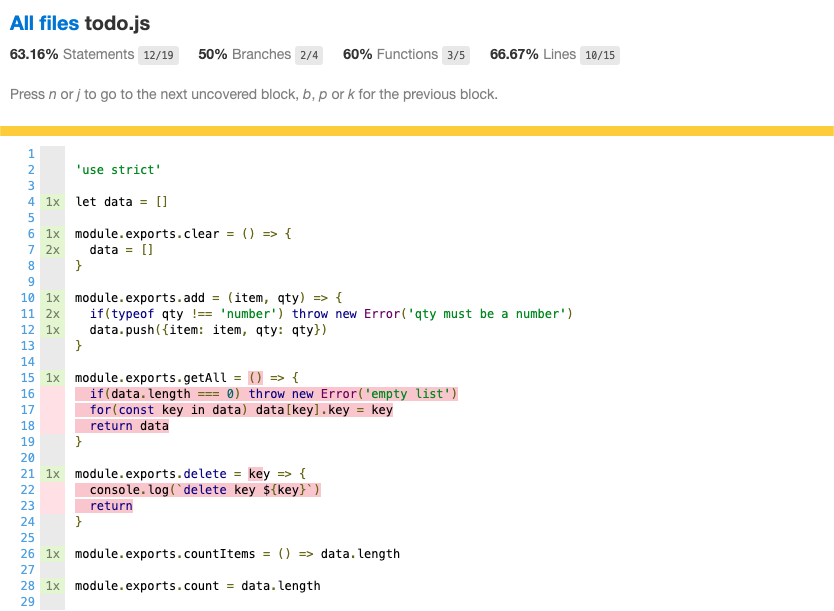
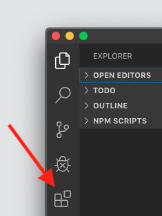
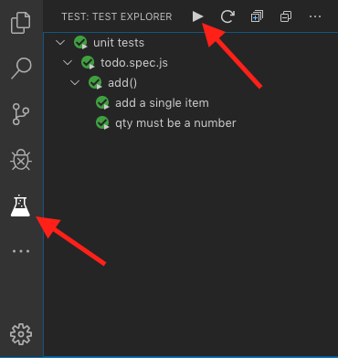
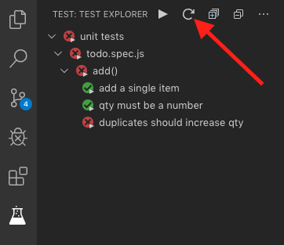
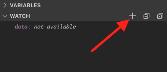
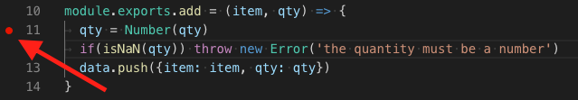
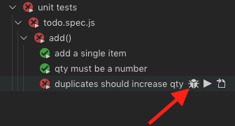
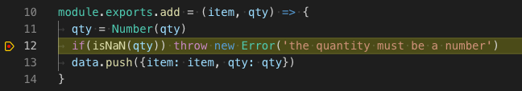

# Automated Testing

In this worksheet you will learn the basics of using automated tests to improve the quality of your code.

Before you start you need to pull any _upstream changes_. Detailed instructions can be found in the **Setup** lab.

We will be using both the Jest commandline tools and the integrated unit testing tools in Visual Studio Code, you should be familiar with both approaches.

## 1 Unit Testing

Unit testing involves testing each _unit_ of code (in our case each module) isolated from the rest of the code in the project. To achieve this we write a _test suite_ that imports our module, calls each function with different values of parameters and checks to see we are getting the right values returned.

We will be using a tool called [Jest](https://jestjs.io) which was originally developed by Facebook to enable them to test their own products.

### 1.1 Opening the Project

READ THE FOLLOWING CAREFULLY

**In the previous labs you have opened the `foundation` directory in VS Code and hd access to all the files and subfolders. The testing tools require you to open the folder containing the project we want to test directly so you will need to use the file menu and open the `foundation/exercises/07_unit_testing/todo/` directory.**

The project has a number of node package dependencies which are listed in the `package.json` file. Start by installing all of these and then you should start the server and have a look at the website. As you can see it is a simple todo list, try adding a few items and deleting them, you will see that only some of the functionality has been implemented!

### 1.2 Understanding the File Structure

If you have opened the correct directory in VS Code you should see these files in the file explorer:

```
.
├── index.js
├── jest-test.config.js
├── modules
│   └── todo.js
├── package.json
├── public
│   └── style.css
├── readme.md
├── unit tests
│   └── todo.spec.js
└── views
    ├── empty.hbs
    └── home.hbs
```

By now you are familiar with most of these however there are a couple of files you may not be familar with:

1. The `jest-test.config.js` file contains the settings used by the **Jest** testing tool.
1. The `modules/` directory contains the code providing the logic for our app (the _Model_ in the _MVC_).
2. The `unit tests/` directory contains our test _fixtures_ (the code containing the tests to run). There should be one test file for each file we want to test, the naming covention is that it should match the name of the file to test with `spec` between the name and extension.

### 1.3 Running the Tests From the CLI

We will start by running the tests from the shell. Open the integrated terminal and run the command:

```shell
$ npm run test

  > todo@1.0.0 test /Users/marktyers/Documents/foundation/exercises/07_unit_testing/todo
  > jest --coverage --runInBand

  PASS  unit tests/todo.spec.js
    add()
      ✓ add a single item (4ms)
      ✓ qty must be a number (1ms)

  ----------|----------|----------|----------|----------|-------------------|
  File      |  % Stmts | % Branch |  % Funcs |  % Lines | Uncovered Line #s |
  ----------|----------|----------|----------|----------|-------------------|
  All files |    63.16 |       50 |       60 |    66.67 |                   |
   todo.js  |    63.16 |       50 |       60 |    66.67 |    16,17,18,22,23 |
  ----------|----------|----------|----------|----------|-------------------|
  Test Suites: 1 passed, 1 total
  Tests:       2 passed, 2 total
  Snapshots:   0 total
  Time:        1.208s
  Ran all test suites.
```

As you can see from the output it has found and run two tests on the `add()` function with both tests passing.

The table provides a code coverage report that shows you how much of your code is covered by the existing tests. If these are less than 100% there are gaps in your testing however just because you have 100% coverage does not mean you have tested all eventualities!

For more details of your code coverage you need to view a detailed report. The testing tool has created a new `coverage/` directory which contains the following:

```
.
├── clover.xml
├── coverage-final.json
├── lcov-report
│   ├── base.css
│   ├── block-navigation.js
│   ├── index.html
│   ├── prettify.css
│   ├── prettify.js
│   ├── sort-arrow-sprite.png
│   ├── sorter.js
│   └── todo.js.html
└── lcov.info
```

Locate the `index.html` file in the **Explorer** tab, right-click on this and choose  Right-click on the `index.html` file and choose **Reveal in Finder** or equivalent. When this is done you can open the file in the Chrome Browser where you will see:


This lists the code coverage for all the files you are testing. If you click on a filename you will see details of precisely which lines of code are being tested and which lines are not covered by your tests:



Any code highlighted in red is not covered by your test suite.

### 1.4 Running the Tests Using Visual Studio Code

In the previous section you learned how to run a test suite and check code coverage just using the CLI (terminal) and this will work regardless of the environment you are using. In this section you will learn how to run your test suite using VS Code together with a feww useful extensions.

### 1.5 Visual Studio Code Extensions

One of the powerful features of VS Code is its support for **Extensions** which allow you to add additional capabilities to the editor. Make sure you are running the _latest_ version of VS Code (1.38.1 at the time of writing).



You should start by opening the tab and checking for the extensions already installed, these will be listed in the **ENABLED** section. If any of these are not listed you can use the search box to search for them and then install. Once the extensions are installed you will need to shutdown and reload VS Code for them to take effect.

In this lab you will need:


1. Coverage Gutters
2. Jest
3. Jest Test Explorer
4. Test Explorer UI

Once installed you will need to _completely shutdown and restart_ the VS Code editor before continuing.

### 1.6 Running a Test Suite

After restarting the editor you should see an additional tab, directly under the **Extensions** tab. This is called the **Test** tab and has an icon that looks like a conical flask from your chemistry lesson. This was added by the **Test Explorer** extension.

If you open this tab you will see the **Test Explorer** which should eventually locate your unit test suites, run them and display them. The first time you will need to expand the tree nodes to see them. There are a number of button along the top. The most prominent of these is the _play_ button. If you click this it will run the entire suite of tests in your project.

If the tests don't load, check at the bottom of the editor to see if Jest has stopped working. There are two main reasons this happens:
1. If there is a space in the path to your project directory. If this happens, close down the editor, move the entire `foundation/` directory to a more suitable location and open the `todo/` directory again using VS Code.
2. If you have opened the `foundation/` directory in VS Code instead of just the `todo/` directory.



The structure is very simple, at the top level is the name of the directory containing the test suites and directly under it the names of any test suites found. Under that are the test suite names and finally any tests it finds in the test suites.

You can run the entire suite of tests using the _play_ button or click on the `...` button and enable autorun which means the tests will run every time you save a file (recommended). If you hover over any of the entries in the Test Explorer you will see a _play_ button to run the tests at that level.

Any failing test is shown with a red circle and cross and tests that pass a green circle and tick. In this way it is very easy to monitor the state of your test suites and quickly spot any issues.

### 1.7 Test-Driven Development

Our next task is to decide what functionality we need to develop next. Run the server and try adding the same item more than once, what happens?

Currently this creates multiple lines in the list however a better solution would be to simply increment the quantity of the existing item.

We will use this task to understand the three-step process involved in **Test-Driven Development**.


1. The first step is to think through the problem and use this to write a test for the functionality we want to implement. We then run the test suite and this new test will fail.
2. We then write enough code so that this new test passes. We check that none of the other tests fail (have we broken existing code)?
3. Finally we clean up (refactor) the code to make it easier to understand. Do all the tests still pass?

This process is sometimes called **red-green-refactor**.

#### 1.7.1 Red: Writing a Test

The tests are grouped by test suite. Our new test is for adding new functionality to the `add()` function and so it needs to go in the space indicated by a comment.

Every test should follow a standard structure known as the **AAA** pattern.

1. A test should ensure the system is **arranged** in a consistent manner.
2. The test should then carry out a single action (**act**).
3. Finally it should verify **assert** that the action has created the intended result.

If you study the test suite carefully you will see that there is a block of code that runs before each test, it is here that we **arrange** the state of the system by clearing out any data from the list. This means that every test starts from the same state.

In our test the **action** should be to add the same item twice.

We can then **assert** using the `expect()` function to see that there is only one item in the list but that the qty has incremented correctly. `expect` gives you access to a number of [matchers](https://jestjs.io/docs/en/expect). In this example we are using:

1. [`.toBe()`](https://jestjs.io/docs/en/expect#tobevalue) checks that two things are the same (the same object for example).
2. [`.toEqual()`](https://jestjs.io/docs/en/expect#toequalvalue) checks that two things contain the same value.

There are a [wide range of matchers](https://jestjs.io/docs/en/expect) available and you should take time to understand their purpose so that you always use the most appropriate ones in your tests. In particular take time to learn the most commonly useful matchers: [`toBeTruthy`](https://jestjs.io/docs/en/expect#tobetruthy), [`toBeFalsy`](https://jestjs.io/docs/en/expect#tobefalsy), [`toHaveLength`](https://jestjs.io/docs/en/expect#tohavelengthnumber), [`toContain`](https://jestjs.io/docs/en/expect#tocontainitem).

A suitable test might look like this:

```javascript
test('duplicates should increase qty', async done => {
	expect.assertions(2)
	try {
		// ACT
		todo.add('bread', 4)
		todo.add('bread', 2)
		// ASSERT
		const count = todo.countItems()
		expect(count).toBe(1)
		const data = todo.getAll()
		const qty = data[0].qty
		expect(qty).toEqual(6)
	} catch(err) {
		done.fail('test failed')
	} finally {
		done()
	}
})
```

Lets examine this code:

1. The test should have a descriptive name, in this case `duplicates should increase qty`.
2. We will be checking two things (asserts) so we specify this up front.
3. We then try to add the same item twice with different quantities (act).
4. Now we assert both that there is one item in the list and that its quantity is correct.
5. We should always check for errors being thrown, in this case we trigger a fail (there should not be any errors).
6. regardless of whether there were errors we call the `done()` function to tell the test runner the test is now over.

Note that you need to look at the **Block** section in the **Variables** panel in the debugger.

If we reload the tests in the test explorer we will see that our new test fails. This is expected behaviour as we have not implemented the code yet!



#### 1.7.2 Green: Passing the Test

The next step is to write enough code to pass the new test. VS Code provides a robust suite of tools to help us with this. Key is the integrated debugger which you covered in the previous lab.

Start by opening the **Debug** tab and add a watch on the `data[]` array. You do this by clicking on the (+) _add expression_ button and entering the name of the variable to watch, in this case `data`. Press the enter key to add.



You should also add a breakpoint in the function by clicking in the gutter to the left of the line number as shown. This will place a small red dot on that line (to remove it after completing the task simply click on it).



Back in the **Test Explorer** hover over the failing test and you should see a _debug_ icon (shown below). Clicking this will trigger the debugger on the selected test.



The test will now run and the debugger will pause execution on the _line following the breakpoint_.



You can now step through your code line by line and examine the `data[]` array contents in the **Watch** window. You will see a number of debugger buttons at the top of the screen.


From left to right:

1. Continue: run until the next breakpoint.
2. Step Over: Executes the next statement in a procedure
3. Step Into: Steps into the subprocedure
4. Step Out: Continues execution until the current procedure ends, returning control to the calling procedure.
5. Restart: stop the debug session and start it again from the beginning.
6. Stop: Terminates the debugger session.

Most of the time you will be using the **Step Over** button.

Continue stepping over the code until ot terminates, keeping an eye on the Watch variable. An alternative to viewing the variables in the debug pane is to hover the cursor over any variable name in the source code before the current line and its value appears as a tool tip!

Now we need to write a solution to pass the test. As you add code keep running the debugger on the failed test.

Here is a possible solution:

```javascript
module.exports.add = (item, qty) => {
	qty = Number(qty)
	if(isNaN(qty)) throw new Error('the quantity must be a number')
	let flag = false
	for(let index in data) {
		if (data[index].item === item) {
			data[index].qty+= qty
			flag = true
		}
	}
	if(flag === false) {
		data.push({item: item, qty: qty})
	}
}
```

Note that we store the data in constants before asserting as this means we can see the data in the debugger. Type in this test (you won't learn much if you copy and paste). Run the debugger and see if you can track the data values.

NOTE: sometimes you need to click on the **Reload tests** button to trigger a full re-run of the tests.

#### 1.7.3 Refactor

Now we can clean up the code (refactor) to make it easier to read. This should be done for both the program code and the test.

There is not a lot we can do to the program code:

```javascript
module.exports.add = (item, qty) => {
	qty = Number(qty)
	if(isNaN(qty)) throw new Error('the quantity must be a number')
	let flag = false
	for(const index in data) {
		if (data[index].item === item) {
			data[index].qty+= qty
			flag = true
		}
	}
	if(flag === false) data.push({item: item, qty: qty})
}
```

Run the test suite to check there are no errors.

```javascript
	test('duplicates should increase qty', async done => {
		expect.assertions(2)
		try {
			// ACT
			todo.add('bread', 4)
			todo.add('bread', 2)
			// ASSERT
			expect(todo.countItems()).toBe(1)
			expect(todo.getAll()[0].qty).toEqual(6)
		} catch(err) {
			done.fail('test failed')
		} finally {
			done()
		}
	})
```

Again, check that all the test still pass. As a final check start the web server and see if it works in the browser. Congratulations, you have now completed your first TDD iteration.

### 1.8 Test Your Understanding

You will now complete a few more TDD iterations:

1. What happens if you leave the item box empty? This should throw an error, not add a blank item.
2. What happens if you leave the qty box empty? Solve this in a similar way.
3. What happens if you click on one of the **Delete** links? Implement this feature. Remember that since this is testing the `delete()` function you need to create a new _test suite_ called `delete()` in the same test suite.
4. Can you write one or more tests for the `getAll()` function?
5. And for the `clear()` function as well.

Try generating a code coverage report, are you getting 100% coverage? If not you may need more tests.

## 2 FIRST Principles

There are some best practices to follow when writing unit tests. The first, **Arrange**, **Act**, **Assert** we have already covered but there is a second, more important one known as [FIRST](https://dzone.com/articles/writing-your-first-unit-tests) and you should ensure you understand and follow these principles to achieve effective unit testing:

1. **FAST**: In a medium-sized project you might have upwards of a couple of hundred tests and each time your code changes you need to run them all. Even if each only took 1 second it would take 3 min+ to run them all! The most important thing therefore is that each test should take milliseconds to run and this means **absolutely no test should write to disk** because writing to disk is very slow.
2. **ISOLATED**: Jest will run your tests in parallel in multiple threads. This means you can't predict the order in which the tests will run and so each test must be completely self-contained and not be dependent on other tests.
3. **REPEATABLE**: A test should produce the same results every time you run it so there should be no external dependencies that might change. For example if your code makes an API call there is a risk the data returned will change over time, breaking the test.
4. **SELF-VALIDATING**: Each test should be able to determine if it passed or failed with no human interpretation required. This means it should conform to the **AAA** pattern covered in the previous section.
5. **TIMELY**: Each test should be written _just before_ the code is implemented. You should not write more than one test at a time. As you get better at TDD you will find that you can complete an entire TDD red-green-refactor iteration in under 5 min!

Looking at these rules they all make sense until you try to apply them to a real problem. In this section of the lab we will be performing TDD on some code that talks to a relational database. This means it could break the first 3 **FIRST** principles!

1. The database is stored on the hard drive so its really slow to read and write data.
2. The database is persistent which means all the tests are reading and writing to a single source. If the tests run in a different order the data will be different!
3. If we run a test on a function that adds a record, each time we run the test we will get a different record id and a different number of records in the database.

### 2.1 Understanding the Code

You should start by opening the `exercises/07_unit_testing/database/` directory in VS Code using the File menu (as we did in the previous section).

Start by running the server and interacting with the website. Note that it works exactly the same as the previous version. Stop and restart the server. Notice that, unlike the previous version, it remembers (persists) the list. Behind the scenes it is storing the data in an SQLite database called `todo.db`.

Try deleting the `todo.db` database file and restarting the server, notice that the data is now lost but the server has created a new database file.

If you examine the code structure it looks superficially like the previous example but there are some key differences. The main difference is in the `modules/todo.js` script.

In this version we export a NodeJS [Class](https://developer.mozilla.org/en-US/docs/Web/JavaScript/Reference/Classes). Remember these are not OOP classes but syntactical sugar on top of the JS prototypal inheritance.

1. The constructor takes a single optional parameter which is the name of the database file to use.
    1. If we don't specify a database filename the database runs [in-memory](https://www.sqlite.org/inmemorydb.html) (more on this later).
		2. The constructor returns a promise.
		3. The constructor creates a connection to the database and creates a table if it does not already exist.
2. Each of the functions is implemented as async methods.
    1. Each runs an SQL query on the database.

The `unit tests/todo.js` script contains the same tests as the array-based version but each test now:

1. Uses an object constructor to get a `ToDo` object asynchronouly.
2. Calls the appropriate async method(s).

### 2.2 In-Memory Databases

As explained earlier, databases break three of the **FIRST** principles because they write to disk and share their data.

Try running the unit tests multiple times noting that they seem to address _all_ the FIRST principles! How is this possible?

The solution is to run the database _in memory_ rather than writing any data to the hard drive. This has two main benefits:

1. Increased performance since we are not touching the hard drive.
2. Each open connection to the database creates its own isolated database that can't be seen by other connections, in other words each time we use the object constructor to create a new `ToDo` object, it comes with its own empty database!

To enable SQLite to run in-memory we simply tell it to use a database file called `:memory:`.

Almost all databases will have this feature, check the documentation.

### 2.3 Handling Exceptions in Async Functions

All the class code in this example uses async functions so that the main thread is not blocked by code reading and writing to the database (on disk). This creates an interesting issue regarding thrown exceptions. As you remember from the lab on code quality, an async function returns a Promise (set to one of three states, pending resolved or rejected). This means that when an exception is thrown it simply sets the Promise state to rejected rather than throwing a traditional Error object.

This means you can't use a try-catch block in your unit tests but instead have to treat the code that will throw the exception as a promise and capture the error at the end of the chain. Jest has built-in support for this, take the following test:

```javascript
test('qty must be a number', async done => {
		expect.assertions(1)
		const todo = await new ToDo()
		await expect( todo.add('bread', 'three') ).rejects.toEqual( Error('the quantity must be a number') )
		done()
	})
```

As you can see, [`rejects`](https://jestjs.io/docs/en/expect#rejects) unwraps the reason for a rejected promise, if the Promise resolves the test automatically fails. This is the only way Jest can check for a thrown Error in your tests.

### 2.4 Test Your Understanding

You will now complete a few more TDD iterations:

1. What happens if you leave the item box empty? This should throw an error, not add a blank item.
2. What happens if you leave the qty box empty? Solve this in a similar way.
3. What happens if you click on one of the **Delete** links? Implement this feature. Remember that since this is testing the `delete()` function you need to create a new _test suite_ called `delete()` in the same test suite.
4. Can you write one or more tests for the `getAll()` function?
5. And for the `clear()` function as well.

As before, are you gettting 100% code coverage? If not, write more tests. Are you covering the edge cases and checking for correct handling of bad data?

Note that there appears to be a bug in the VS Code debugger when stepping through a function that returns a promise. If the debugger sends you to a script called `async_hooks.js` you can get stuck in an loop. When the debugger is highlighting the closing brace of an async function press the **Step Out** button a few times (typically) to return to the parent function. Remember you can add breakpoints to the test as well as the module code.
